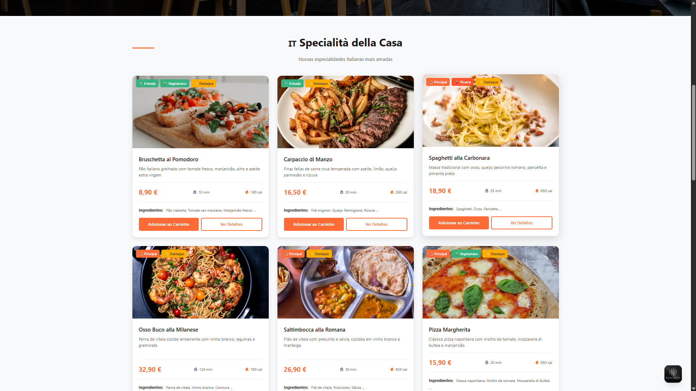
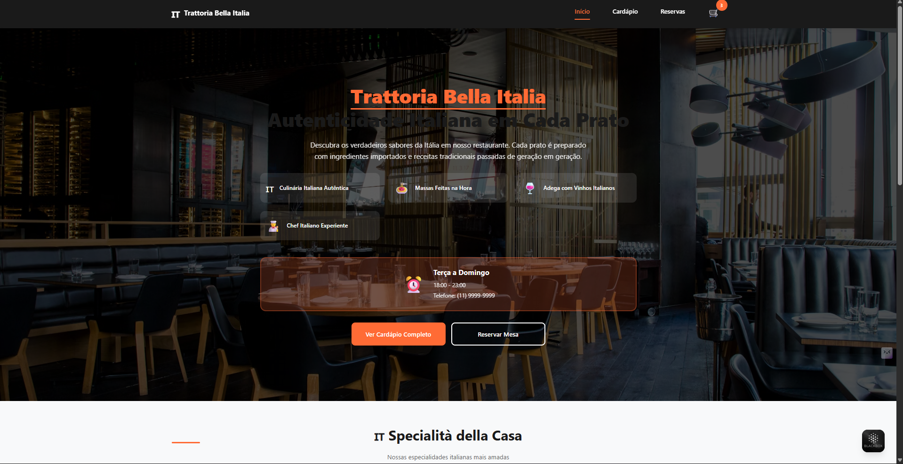

# 🍝 Trattoria Bella Italia - Restaurant Web App


Uma aplicação web moderna para um restaurante italiano, construída com Angular 17+. Oferece uma experiência completa de usuário com cardápio interativo, sistema de carrinho, reservas de mesa e checkout.



## ✨ Funcionalidades

### 🎯 Core Features
- **Página Inicial** com seção hero, destaques e promoções
- **Cardápio Completo** com categorias (Antipasti, Piatti Principali, Dolci, Bevande)
- **Filtros Avançados** (vegetariano, picante, faixa de preço)
- **Detalhes do Prato** com galeria de imagens e informações nutricionais
- **Carrinho de Compras** com controle de quantidades
- **Fluxo de Checkout** com validação de formulários
- **Sistema de Reservas** com verificação de disponibilidade
- **Design Responsivo** (mobile-first)

### 🚀 Funcionalidades Avançadas
- **Loading Skeletons** para melhor UX durante carregamento
- **Empty States** para feedback visual em estados vazios
- **Validação de Formulários** em tempo real
- **Persistência Local** (carrinho e reservas)
- **Animações e Transições** suaves
- **Ícones e Badges** informativos

##  Arquitetura do Projeto

```
restaurant-web-app/
├── src/
│   ├── app/
│   │   ├── components/
│   │   │   ├── layout/           # Componentes de layout
│   │   │   │   ├── header/       # Cabeçalho com navegação
│   │   │   │   └── footer/       # Rodapé com informações
│   │   │   ├── pages/            # Páginas principais
│   │   │   │   ├── home/         # Página inicial
│   │   │   │   ├── menu/         # Cardápio com filtros
│   │   │   │   ├── cart/         # Carrinho de compras
│   │   │   │   ├── checkout/     # Finalização de pedido
│   │   │   │   ├── reservation/  # Reservas de mesa
│   │   │   │   └── dish-detail/  # Detalhes do prato
│   │   │   └── shared/           # Componentes reutilizáveis
│   │   │       ├── menu-card/    # Card do prato
│   │   │       ├── cart-item/    # Item do carrinho
│   │   │       ├── filter-sidebar/ # Filtros do cardápio
│   │   │       ├── promo-banner/ # Banner de promoções
│   │   │       ├── hero-section/ # Seção hero da home
│   │   │       ├── loading-skeleton/ # Skeletons de loading
│   │   │       └── empty-state/  # Estados vazios
│   │   ├── services/             # Serviços de dados
│   │   │   ├── restaurant.service.ts  # Dados dos pratos
│   │   │   ├── cart.service.ts        # Gerenciamento do carrinho
│   │   │   └── reservation.service.ts # Sistema de reservas
│   │   ├── models/               # Interfaces TypeScript
│   │   │   └── dish.model.ts     # Modelos de dados
│   │   ├── utils/                # Utilitários
│   │   ├── app.component.ts      # Componente raiz
│   │   ├── app.routes.ts         # Configuração de rotas
│   │   └── app.config.ts         # Configuração da aplicação
│   ├── assets/                   # Recursos estáticos
│   │   ├── images/               # Imagens
│   │   └── icons/                # Ícones
│   └── styles.scss               # Estilos globais
├── angular.json                  # Configuração do Angular CLI
├── package.json                  # Dependências do projeto
└── README.md                     # Este arquivo
```

## 🛠️ Tecnologias Utilizadas

- **Angular 17+** - Framework principal
- **TypeScript** - Tipagem estática
- **SCSS** - Estilização avançada
- **RxJS** - Programação reativa
- **Angular Router** - Navegação entre páginas
- **Reactive Forms** - Formulários reativos
- **Standalone Components** - Componentes independentes

## 📱 Páginas da Aplicação

### 1. 🏠 Página Inicial (`/home`)
- Seção hero com call-to-action
- Pratos em destaque da semana
- Banner de promoções ativas
- Links para cardápio e reservas

### 2. 🍽️ Cardápio (`/menu`)
- Grid de pratos com categorias
- Sidebar de filtros (vegetariano, picante, preço)
- Busca por categorias
- Cards com informações detalhadas

### 3. 🛒 Carrinho (`/cart`)
- Lista de itens com controle de quantidade
- Cálculo automático de totais
- Entrega grátis para pedidos acima de 30€
- Botão para checkout

### 4. ✅ Checkout (`/checkout`)
- Fluxo de 3 etapas (entrega, pagamento, confirmação)
- Validação de formulários em tempo real
- Múltiplos métodos de pagamento
- Confirmação com número do pedido

### 5. 📅 Reservas (`/reservation`)
- Formulário de reserva com validação
- Verificação de disponibilidade
- Confirmação com número da reserva
- Informações do restaurante

### 6. 🔍 Detalhes do Prato (`/dish/:id`)
- Galeria de imagens
- Informações nutricionais
- Lista de ingredientes
- Pratos relacionados
- Botões de ação (adicionar ao carrinho, comprar agora)


### Executando
```bash
# Desenvolvimento
ng serve

# Build
ng build

# Testes
ng test

# Lint
ng lint
```

### Estrutura de Pastas
Mantenha a estrutura atual ao adicionar novos componentes/serviços.

## Testes
- Testes unitários para serviços
- Testes de componente quando complexos
- Mantenha cobertura acima de 80%

## Dúvidas?
Abra uma issue ou entre em contato com os mantenedores.
```

## ARQUIVO ADICIONAL: `CHANGELOG.md`

```markdown
# Changelog

Todas as mudanças notáveis neste projeto serão documentadas neste arquivo.

## [1.0.0] - 2024-12-28

### Adicionado
- Projeto inicial com Angular 17+
- Sistema completo de cardápio italiano
- Carrinho de compras com persistência
- Fluxo de checkout de 3 etapas
- Sistema de reservas de mesa
- Páginas de detalhes dos pratos
- Componentes de loading skeleton
- Estados vazios personalizados
- Design responsivo mobile-first
- Validação de formulários
- Rotas com lazy loading

### Tecnologias
- Angular 17 com standalone components
- TypeScript para tipagem estática
- SCSS para estilização avançada
- RxJS para programação reativa
- LocalStorage para persistência

### Design
- Sistema de cores italiano
- Tipografia clara e legível
- Animações suaves
- Ícones e badges informativos
- Layout responsivo completo
```
